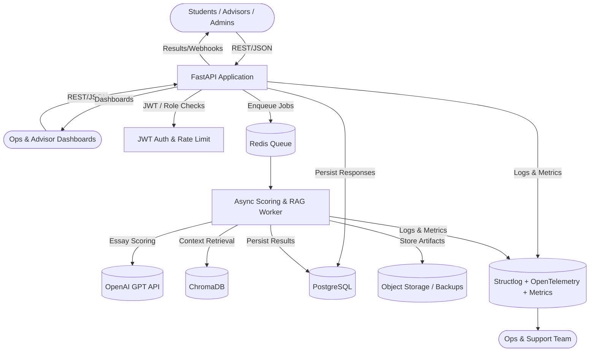
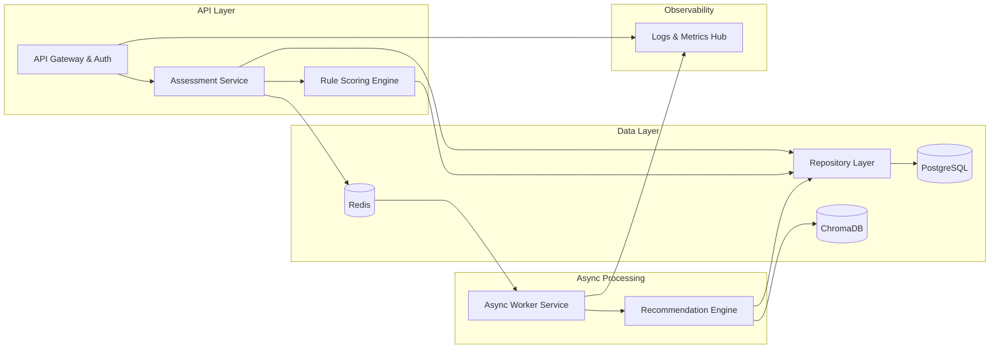
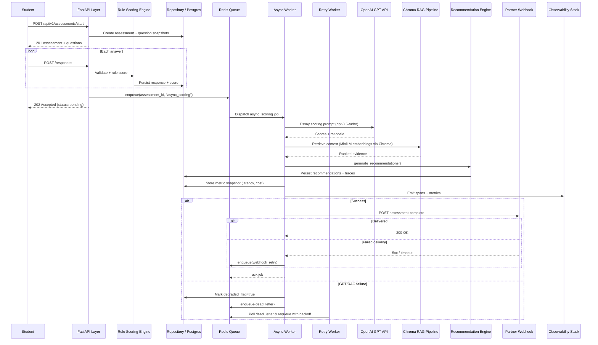
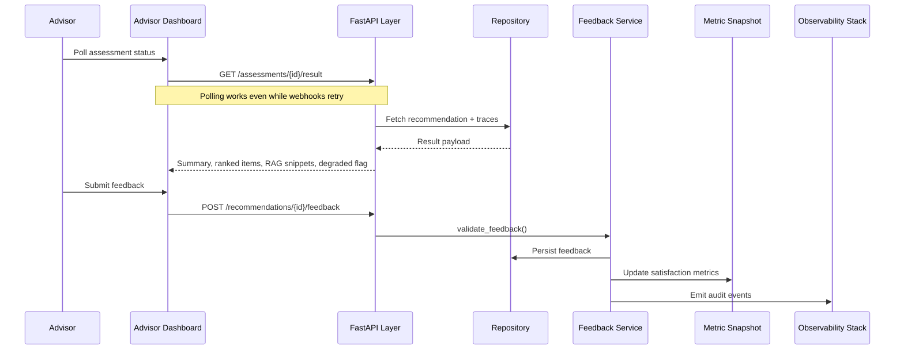

# AI-Powered Micro-Credential Assessment Backend Architecture Document

## Introduction
This document outlines the backend architecture for the AI-Powered Micro-Credential Assessment project. It covers the FastAPI-based services, asynchronous workers, data stores, and operational practices required to deliver explainable hybrid scoring and recommendations. A future Frontend Architecture document should be produced for the dashboards referenced in the PRD; stack decisions captured here remain authoritative for any UI work.

### Starter Template or Existing Project
No existing starter template or codebase is being reused. A lightweight FastAPI monorepo scaffold will be created (via Cookiecutter or custom script) to align with the async queue, Postgres, Redis, and embedding requirements.

### Change Log
| Date       | Version | Description                                               | Author               |
| ---------- | ------- | --------------------------------------------------------- | -------------------- |
| 2025-10-14 | v0.1    | Initial architecture draft aligned with PRD v4 decisions. | Winston (Architect)  |

## High Level Architecture

### Technical Summary
The system is a domain-oriented modular monolith built on FastAPI with Redis-backed workers. Core components include the HTTP API, rule-based scoring engine, asynchronous GPT/RAG workers, PostgreSQL with ChromaDB for embeddings, and observability tooling. This structure satisfies the PRD’s async scoring, transparency, and cost goals while remaining simple to operate on low-cost platforms.

### High Level Overview
1. **Architectural Style:** Modular monolith with clearly separated domain modules (assessment intake, scoring, recommendations, observability).  
2. **Repository Structure:** Monorepo to share domain models, migrations, and infrastructure scripts.  
3. **Service Architecture:** FastAPI application for synchronous routes plus horizontally scaled RQ workers processing GPT/RAG tasks from Redis.  
4. **Primary Flow:** Students submit assessments → API validates and applies rule scoring → responses persisted → async jobs queued for GPT essay scoring and RAG enrichment → workers produce recommendations and traces → results exposed via polling/webhooks.  
5. **Key Decisions:** Retain monolith for MVP speed, isolate long-running work in Redis queues, leverage Postgres + Chroma for shared storage, and instrument everything with structured logs/metrics.

### High Level Project Diagram


### Architectural and Design Patterns
- **Domain-Oriented Modular Monolith:** Keeps implementation cohesive while preserving module boundaries for future extraction.
- **Queue-Based Work Dispatch:** Redis + RQ isolate GPT/RAG latency and provide retries/dead-letter handling.
- **Hexagonal Ports & Adapters:** External services (OpenAI, Chroma, webhooks) accessed through adapter modules to improve testability.
- **Repository + Unit of Work:** All persistence flows through repositories to enforce consistency between API and workers.
- **REST with Webhook Notifications:** REST APIs plus optional webhooks cover both polling and push-based advisor experiences.

## Tech Stack

### Cloud Infrastructure
- **Provider:** Railway (primary) or Render; AWS ECS Fargate documented as a future upgrade path when budget allows.
- **Key Services:** Railway/Render app services for API and worker, managed Postgres, managed Redis, platform TLS, metrics dashboards.
- **Regions:** Railway us-east deployment (default); document switch path if latency requires another region.

### Technology Stack Table
| Category               | Technology                                 | Version      | Purpose                                  | Rationale                                                                 |
| ---------------------- | ------------------------------------------- | ------------ | ---------------------------------------- | ------------------------------------------------------------------------- |
| Language               | Python                                      | 3.12.2       | Unified runtime                          | Matches PRD preference; modern async features.                            |
| Backend Framework      | FastAPI                                     | 0.110.2      | HTTP API server                          | High-performance async with auto OpenAPI docs.                            |
| Data Validation        | Pydantic                                    | 2.8.2        | Request/response validation              | Native FastAPI integration.                                               |
| ORM                    | SQLAlchemy (async)                          | 2.0.25       | Data access layer                        | Mature ORM with async support.                                            |
| Migrations             | Alembic                                     | 1.13.2       | Database migrations                      | Standard with SQLAlchemy.                                                 |
| Background Jobs        | RQ                                          | 1.15.1       | Redis-backed job processing              | Lightweight and aligns with PRD.                                          |
| Scheduler              | rq-scheduler                                | 0.12.0       | Scheduled jobs                           | Refresh embeddings and cleanup tasks.                                     |
| AI Model               | OpenAI gpt-3.5-turbo                        | 2024-05-01   | Essay scoring & explanations             | Cost-effective balance for MVP.                                           |
| RAG Framework          | LangChain                                   | 0.1.23       | RAG pipeline orchestration               | Compatible with Chroma and OpenAI.                                        |
| Embedding Model        | sentence-transformers all-MiniLM-L6-v2      | 2.2.2        | Local embedding generation               | Low-cost embedding per Haystack tutorial.                                 |
| Collaborative Filtering| scikit-learn                                | 1.5.2        | KNN recommendation blending              | Implements KNN as referenced in research.                                 |
| Database               | PostgreSQL (managed)                        | 15.5         | System of record                         | Aligns with PRD technical assumptions.                                    |
| Vector Store           | ChromaDB                                    | 0.4.24       | Semantic search storage                  | Open-source, deployable alongside Postgres.                               |
| Cache/Queue            | Redis                                       | 7.2 managed  | Queue + caching                          | Powers RQ jobs and optional caching.                                      |
| Containerization       | Docker                                      | 25.0.5       | Dev/prod parity                          | Standard container tooling.                                               |
| Hosting                | Railway / Render                            | 2024 stack   | Deployment platform                      | Provides free-tier hosting for API + workers.                             |
| CI/CD                  | GitHub Actions                              | 2024 runner  | Build, test, deploy                      | Integrates with repository workflows.                                     |
| Logging                | structlog                                   | 24.1.0       | Structured logging                       | Produces audit-ready JSON logs.                                           |
| Testing                | pytest                                      | 8.2.1        | Test runner                              | Async-friendly testing.                                                   |
| Linting                | ruff                                        | 0.5.7        | Lint + format                            | Fast linting and formatting.                                              |
| Formatting             | black (via ruff)                            | 24.8.0       | Code formatting                          | Consistent style with minimal config.                                     |

## Data Models
- **User:** Represents students, advisors, admins; owns assessments, recommendations, feedback.  
- **RoleCatalog:** Defines role tracks and skill profiles; referenced by assessments and questions.  
- **Question:** Canonical question definitions; snapshot taken per assessment for immutability.  
- **Assessment:** Captures lifecycle state, role, degraded flag; aggregate root for responses and scores.  
- **AssessmentResponse:** Stores immutable answer snapshots tied to question snapshot.  
- **RuleScore / EssayScore:** Separate deterministic and GPT scoring outputs with explanations and metrics.  
- **Recommendation:** Stores final summary, status, degraded flag, metrics; one-to-one with assessment.  
- **RecommendationItem:** Individual micro-credential suggestions with confidence and rationale.  
- **CredentialCatalog:** Inventory of micro-credentials with metadata and embeddings.  
- **RagTrace:** Evidence snippets supporting recommendations with similarity scores.  
- **EmbeddingArtifact:** Tracks embedding vectors/provider per entity for reproducibility.  
- **AsyncJob:** Represents queued GPT/RAG jobs with retry metadata.  
- **WebhookEvent:** Records outbound notification attempts and responses.  
- **Feedback:** Advisor/student feedback on recommendations.  
- **AuditLog:** Captures security-relevant actions.  
- **MetricSnapshot:** Stores latency and cost metrics for audits.

## Components

#### API Gateway & Auth Layer
- **Responsibility:** HTTP routing, JWT auth, rate limiting, request validation.  
- **Key Interfaces:** `POST /api/v1/assessments/start`, `POST /api/v1/assessments/{id}/responses`.  
- **Dependencies:** Auth utilities, Assessment Service, Redis publisher, structlog.  
- **Tech:** FastAPI, Pydantic, slowapi, PyJWT.

#### Assessment Service
- **Responsibility:** Manage assessment lifecycle, question snapshotting, rule scoring coordination.  
- **Key Interfaces:** `start_assessment`, `finalize_assessment`.  
- **Dependencies:** Repositories, Question catalog, Rule Scoring Engine, Async Job Producer.  
- **Tech:** SQLAlchemy repositories, domain models.

#### Rule Scoring Engine
- **Responsibility:** Deterministic rule evaluation for non-essay questions.  
- **Key Interfaces:** `score_rules`, `get_rule_scores`.  
- **Dependencies:** Assessment Service, rule configuration, repositories.  
- **Tech:** Python modules with YAML/JSON rule definitions.

#### Async Worker Service
- **Responsibility:** Process GPT essay scoring, RAG enrichment, recommendation assembly.  
- **Key Interfaces:** Redis job handlers (`essay_score`, `rag_enrich`).  
- **Dependencies:** Redis, OpenAI, Recommendation Engine, repositories.  
- **Tech:** RQ, rq-scheduler, structlog, OpenTelemetry.

#### Recommendation Engine
- **Responsibility:** Fuse rule/GPT scores with vector retrieval and KNN blending.  
- **Key Interfaces:** `generate_recommendations`, `build_summary`.  
- **Dependencies:** ChromaDB, sentence-transformers, scikit-learn, Embedding registry.  
- **Tech:** LangChain, MiniLM embeddings, scikit-learn.

#### Data & Repository Layer
- **Responsibility:** Centralized data access, transactions, audit logging.  
- **Key Interfaces:** Repository classes and unit-of-work context.  
- **Dependencies:** PostgreSQL, SQLAlchemy sessions.  
- **Tech:** SQLAlchemy async engine, Alembic migrations.

#### Observability Hub
- **Responsibility:** Logs, traces, metrics export to platform monitoring.  
- **Key Interfaces:** OpenTelemetry exporters, Prometheus endpoints (optional).  
- **Dependencies:** API, workers, platform metrics.  
- **Tech:** structlog JSON logging, OpenTelemetry SDK.

### Component Diagram


## External APIs
- **OpenAI API**  
  - Purpose: GPT essay scoring and fallback embeddings.  
  - Docs: https://platform.openai.com/docs/api-reference/introduction  
  - Base URL: `https://api.openai.com/v1`  
  - Auth: Bearer token via `Authorization: Bearer <OPENAI_API_KEY>`  
  - Endpoints: `POST /chat/completions`, `POST /embeddings`  
  - Notes: Use exponential backoff retries, record token usage for cost tracking.

- **Webhook Subscribers (Partner Systems)**  
  - Purpose: Notify advisor platforms when recommendations complete.  
  - Auth: HMAC signature with shared secret stored in platform env vars.  
  - Endpoint: `POST /webhooks/assessment-complete` (partner-defined).  
  - Notes: Store delivery attempts and responses; enable retries with dead-letter queue.

## Core Workflows





## REST API Spec
```yaml
openapi: 3.0.0
info:
  title: AI Micro-Credential Assessment API
  version: 0.1.0
  description: >
    REST API powering asynchronous assessments, scoring, and recommendations.
servers:
  - url: https://api.microcred.local/v1
    description: Staging environment (Railway)
  - url: https://api.microcred.prod/v1
    description: Production environment
security:
  - bearerAuth: []
paths:
  /assessments/start:
    post:
      tags: [Assessments]
      summary: Start a new assessment
      requestBody:
        required: true
        content:
          application/json:
            schema:
              $ref: '#/components/schemas/AssessmentStartRequest'
      responses:
        '201':
          description: Assessment created
          content:
            application/json:
              schema:
                $ref: '#/components/schemas/AssessmentStartResponse'
        '400':
          description: Invalid role or missing prerequisites
        '401':
          description: Unauthorized
  /assessments/{assessment_id}/responses:
    post:
      tags: [Assessments]
      summary: Submit responses batch
      parameters:
        - $ref: '#/components/parameters/AssessmentId'
      requestBody:
        required: true
        content:
          application/json:
            schema:
              $ref: '#/components/schemas/AssessmentResponseBatch'
      responses:
        '202':
          description: Accepted; async processing queued when complete
          content:
            application/json:
              schema:
                $ref: '#/components/schemas/AssessmentSubmissionAck'
        '400':
          description: Invalid payload or assessment state
        '404':
          description: Assessment not found
  /assessments/{assessment_id}:
    get:
      tags: [Assessments]
      summary: Get assessment status
      parameters:
        - $ref: '#/components/parameters/AssessmentId'
      responses:
        '200':
          description: Status payload
          content:
            application/json:
              schema:
                $ref: '#/components/schemas/AssessmentStatus'
        '404':
          description: Not found
  /assessments/{assessment_id}/result:
    get:
      tags: [Assessments, Recommendations]
      summary: Retrieve final recommendation result
      parameters:
        - $ref: '#/components/parameters/AssessmentId'
      responses:
        '200':
          description: Recommendation ready
          content:
            application/json:
              schema:
                $ref: '#/components/schemas/AssessmentResult'
        '202':
          description: Still processing
        '404':
          description: Not found
  /recommendations/{recommendation_id}/feedback:
    post:
      tags: [Recommendations]
      summary: Submit feedback for a recommendation
      parameters:
        - $ref: '#/components/parameters/RecommendationId'
      requestBody:
        required: true
        content:
          application/json:
            schema:
              $ref: '#/components/schemas/RecommendationFeedbackRequest'
      responses:
        '201':
          description: Feedback recorded
        '400':
          description: Invalid payload
        '404':
          description: Recommendation not found
  /catalog/credentials:
    get:
      tags: [Catalog]
      summary: List credential catalog entries
      parameters:
        - in: query
          name: role_id
          schema:
            type: string
          description: Optional filter by role
        - in: query
          name: page
          schema:
            type: integer
            minimum: 1
            default: 1
        - in: query
          name: page_size
          schema:
            type: integer
            minimum: 10
            maximum: 100
            default: 25
      responses:
        '200':
          description: Paginated credential list
          content:
            application/json:
              schema:
                $ref: '#/components/schemas/CredentialList'
        '401':
          description: Unauthorized
        '403':
          description: Forbidden
components:
  securitySchemes:
    bearerAuth:
      type: http
      scheme: bearer
      bearerFormat: JWT
  parameters:
    AssessmentId:
      name: assessment_id
      in: path
      required: true
      schema:
        type: string
    RecommendationId:
      name: recommendation_id
      in: path
      required: true
      schema:
        type: string
  schemas:
    AssessmentStartRequest:
      type: object
      required: [role_id]
      properties:
        role_id:
          type: string
        metadata:
          type: object
          additionalProperties: true
    AssessmentStartResponse:
      type: object
      required: [assessment_id, status, questions]
      properties:
        assessment_id:
          type: string
        status:
          type: string
          enum: [in_progress, completed, awaiting_async]
        expires_at:
          type: string
          format: date-time
        questions:
          type: array
          items:
            $ref: '#/components/schemas/QuestionSnapshot'
    QuestionSnapshot:
      type: object
      required: [question_id, type, prompt, rubric]
      properties:
        question_id:
          type: string
        type:
          type: string
          enum: [multiple_choice, essay, profile]
        prompt:
          type: string
        choices:
          type: array
          items:
            type: string
          nullable: true
        rubric:
          type: object
          additionalProperties: true
        version:
          type: string
    AssessmentResponseBatch:
      type: object
      required: [responses]
      properties:
        responses:
          type: array
          minItems: 1
          items:
            $ref: '#/components/schemas/AssessmentResponseItem'
        completed:
          type: boolean
    AssessmentResponseItem:
      type: object
      required: [question_id, answer]
      properties:
        question_id:
          type: string
        answer:
          oneOf:
            - type: string
            - type: number
            - type: object
              additionalProperties: true
        submitted_at:
          type: string
          format: date-time
    AssessmentSubmissionAck:
      type: object
      required: [assessment_id, status, async_job_enqueued]
      properties:
        assessment_id:
          type: string
        status:
          type: string
          enum: [in_progress, awaiting_async, completed]
        async_job_enqueued:
          type: boolean
        message:
          type: string
    AssessmentStatus:
      type: object
      required: [assessment_id, status, progress, degraded]
      properties:
        assessment_id:
          type: string
        status:
          type: string
          enum: [in_progress, awaiting_async, completed, failed]
        progress:
          type: object
          properties:
            answered:
              type: integer
            total:
              type: integer
        degraded:
          type: boolean
        last_updated_at:
          type: string
          format: date-time
    AssessmentResult:
      type: object
      required: [assessment_id, summary, recommendation_items, traces, metrics, degraded]
      properties:
        assessment_id:
          type: string
        summary:
          type: string
        recommendation_items:
          type: array
          items:
            $ref: '#/components/schemas/RecommendationItem'
        traces:
          type: array
          items:
            $ref: '#/components/schemas/RagTrace'
        metrics:
          $ref: '#/components/schemas/ProcessingMetrics'
        degraded:
          type: boolean
        completed_at:
          type: string
          format: date-time
    RecommendationItem:
      type: object
      required: [credential_id, title, confidence, rationale]
      properties:
        credential_id:
          type: string
        title:
          type: string
        confidence:
          type: number
        rationale:
          type: string
        source_trace_ids:
          type: array
          items:
            type: string
    RagTrace:
      type: object
      required: [trace_id, source_uri, snippet, similarity]
      properties:
        trace_id:
          type: string
        source_uri:
          type: string
          format: uri
        snippet:
          type: string
        similarity:
          type: number
        embedding_provider:
          type: string
          enum: [sentence-transformers, openai]
    ProcessingMetrics:
      type: object
      required: [total_latency_ms, token_cost_cents]
      properties:
        total_latency_ms:
          type: integer
        token_cost_cents:
          type: number
        gpt_latency_ms:
          type: integer
        rag_latency_ms:
          type: integer
    RecommendationFeedbackRequest:
      type: object
      required: [relevance_score]
      properties:
        relevance_score:
          type: integer
          minimum: 1
          maximum: 5
        acceptance_status:
          type: string
          enum: [accepted, rejected, pending]
        comments:
          type: string
        submitted_by_role:
          type: string
          enum: [student, advisor]
    CredentialList:
      type: object
      required: [items, page, page_size, total]
      properties:
        items:
          type: array
          items:
            $ref: '#/components/schemas/Credential'
        page:
          type: integer
        page_size:
          type: integer
        total:
          type: integer
    Credential:
      type: object
      required: [credential_id, title, description, skills]
      properties:
        credential_id:
          type: string
        title:
          type: string
        description:
          type: string
        skills:
          type: array
          items:
            type: string
        provider:
          type: string
        embedding_vector_ref:
          type: string
          description: Reference for embedding artifact
    ErrorResponse:
      type: object
      required: [error_code, message]
      properties:
        error_code:
          type: string
        message:
          type: string
```

## API Documentation
- FastAPI automatically exposes interactive Swagger UI at `/docs` and ReDoc at `/redoc`, powered by the OpenAPI spec above.  
- The canonical YAML lives at `docs/api/openapi.yaml`; regenerate it via `scripts/export-openapi.sh` whenever routes change.  
- CI should diff the FastAPI-generated schema against the committed file to prevent drift.  
- MkDocs (Material theme) can ingest the same YAML to publish static API docs if a marketing/partner portal is needed.

## Database Schema
```sql
-- Roles and Users
CREATE TABLE role_catalog (
  id UUID PRIMARY KEY,
  name VARCHAR(64) NOT NULL,
  description TEXT,
  skills_profile JSONB,
  active BOOLEAN NOT NULL DEFAULT TRUE,
  created_at TIMESTAMPTZ NOT NULL DEFAULT NOW()
);

CREATE TABLE users (
  id UUID PRIMARY KEY,
  email CITEXT UNIQUE NOT NULL,
  role VARCHAR(32) NOT NULL CHECK (role IN ('student','advisor','admin')),
  profile JSONB,
  status VARCHAR(16) NOT NULL DEFAULT 'active',
  created_at TIMESTAMPTZ NOT NULL DEFAULT NOW(),
  updated_at TIMESTAMPTZ NOT NULL DEFAULT NOW()
);

-- Questions and assessments
CREATE TABLE questions (
  id UUID PRIMARY KEY,
  role_id UUID REFERENCES role_catalog(id),
  question_type VARCHAR(32) NOT NULL CHECK (question_type IN ('multiple_choice','essay','profile')),
  prompt TEXT NOT NULL,
  choices JSONB,
  rubric JSONB NOT NULL,
  weight NUMERIC(5,2) NOT NULL,
  version VARCHAR(32) NOT NULL,
  active BOOLEAN NOT NULL DEFAULT TRUE,
  created_at TIMESTAMPTZ NOT NULL DEFAULT NOW()
);

CREATE TABLE assessments (
  id UUID PRIMARY KEY,
  user_id UUID REFERENCES users(id),
  role_id UUID REFERENCES role_catalog(id),
  status VARCHAR(24) NOT NULL CHECK (status IN ('in_progress','awaiting_async','completed','failed')),
  degraded BOOLEAN NOT NULL DEFAULT FALSE,
  started_at TIMESTAMPTZ NOT NULL DEFAULT NOW(),
  completed_at TIMESTAMPTZ,
  metadata JSONB,
  created_at TIMESTAMPTZ NOT NULL DEFAULT NOW(),
  updated_at TIMESTAMPTZ NOT NULL DEFAULT NOW()
);

CREATE TABLE assessment_question_snapshots (
  id UUID PRIMARY KEY,
  assessment_id UUID REFERENCES assessments(id) ON DELETE CASCADE,
  question_id UUID NOT NULL,
  prompt TEXT NOT NULL,
  rubric JSONB NOT NULL,
  question_type VARCHAR(32) NOT NULL,
  choices JSONB,
  weight NUMERIC(5,2),
  version VARCHAR(32) NOT NULL,
  UNIQUE (assessment_id, question_id)
);

CREATE TABLE assessment_responses (
  id UUID PRIMARY KEY,
  assessment_id UUID REFERENCES assessments(id) ON DELETE CASCADE,
  question_snapshot_id UUID REFERENCES assessment_question_snapshots(id),
  answer JSONB NOT NULL,
  submitted_at TIMESTAMPTZ NOT NULL DEFAULT NOW(),
  UNIQUE (assessment_id, question_snapshot_id)
);

-- Scoring
CREATE TABLE rule_scores (
  id UUID PRIMARY KEY,
  assessment_id UUID REFERENCES assessments(id) ON DELETE CASCADE,
  question_snapshot_id UUID REFERENCES assessment_question_snapshots(id),
  score NUMERIC(5,2) NOT NULL,
  explanation TEXT,
  rules_applied JSONB,
  created_at TIMESTAMPTZ NOT NULL DEFAULT NOW(),
  UNIQUE (assessment_id, question_snapshot_id)
);

CREATE TABLE essay_scores (
  id UUID PRIMARY KEY,
  assessment_id UUID REFERENCES assessments(id) ON DELETE CASCADE,
  question_snapshot_id UUID REFERENCES assessment_question_snapshots(id),
  score NUMERIC(5,2),
  model VARCHAR(64) NOT NULL,
  prompt_version VARCHAR(32) NOT NULL,
  latency_ms INTEGER,
  cost_cents NUMERIC(7,2),
  response_payload JSONB,
  created_at TIMESTAMPTZ NOT NULL DEFAULT NOW(),
  UNIQUE (assessment_id, question_snapshot_id)
);

-- Recommendations
CREATE TABLE credential_catalog (
  id UUID PRIMARY KEY,
  title TEXT NOT NULL,
  description TEXT,
  skills TEXT[],
  provider TEXT,
  metadata JSONB,
  active BOOLEAN NOT NULL DEFAULT TRUE,
  created_at TIMESTAMPTZ NOT NULL DEFAULT NOW()
);

CREATE TABLE embedding_artifacts (
  id UUID PRIMARY KEY,
  entity_type VARCHAR(32) NOT NULL,
  entity_id UUID NOT NULL,
  provider VARCHAR(32) NOT NULL,
  vector VECTOR(384),
  raw_embedding BYTEA,
  created_at TIMESTAMPTZ NOT NULL DEFAULT NOW(),
  UNIQUE (entity_type, entity_id, provider)
);

CREATE TABLE recommendations (
  id UUID PRIMARY KEY,
  assessment_id UUID REFERENCES assessments(id) UNIQUE,
  summary TEXT,
  degraded BOOLEAN NOT NULL DEFAULT FALSE,
  status VARCHAR(24) NOT NULL CHECK (status IN ('pending','ready','failed')),
  generated_at TIMESTAMPTZ,
  metrics JSONB,
  created_at TIMESTAMPTZ NOT NULL DEFAULT NOW()
);

CREATE TABLE recommendation_items (
  id UUID PRIMARY KEY,
  recommendation_id UUID REFERENCES recommendations(id) ON DELETE CASCADE,
  credential_id UUID REFERENCES credential_catalog(id),
  title TEXT NOT NULL,
  confidence NUMERIC(5,3) NOT NULL,
  rationale TEXT,
  source_trace_ids UUID[],
  position INTEGER NOT NULL,
  UNIQUE (recommendation_id, credential_id)
);

CREATE TABLE rag_traces (
  id UUID PRIMARY KEY,
  recommendation_id UUID REFERENCES recommendations(id) ON DELETE CASCADE,
  source_uri TEXT NOT NULL,
  snippet TEXT NOT NULL,
  similarity NUMERIC(5,3) NOT NULL,
  embedding_artifact_id UUID REFERENCES embedding_artifacts(id),
  created_at TIMESTAMPTZ NOT NULL DEFAULT NOW()
);

-- Async jobs and notifications
CREATE TABLE async_jobs (
  id UUID PRIMARY KEY,
  assessment_id UUID REFERENCES assessments(id),
  job_type VARCHAR(32) NOT NULL,
  status VARCHAR(24) NOT NULL,
  attempts INTEGER NOT NULL DEFAULT 0,
  payload JSONB,
  error_payload JSONB,
  queued_at TIMESTAMPTZ NOT NULL DEFAULT NOW(),
  completed_at TIMESTAMPTZ,
  next_run_at TIMESTAMPTZ
);

CREATE TABLE webhook_events (
  id UUID PRIMARY KEY,
  assessment_id UUID REFERENCES assessments(id),
  event_type VARCHAR(32) NOT NULL,
  payload JSONB NOT NULL,
  status VARCHAR(24) NOT NULL,
  response_code INTEGER,
  last_attempt TIMESTAMPTZ,
  attempts INTEGER NOT NULL DEFAULT 0,
  created_at TIMESTAMPTZ NOT NULL DEFAULT NOW()
);

-- Feedback, auditing, metrics
CREATE TABLE recommendation_feedback (
  id UUID PRIMARY KEY,
  recommendation_id UUID REFERENCES recommendations(id) ON DELETE CASCADE,
  submitted_by UUID REFERENCES users(id),
  submitted_by_role VARCHAR(16) NOT NULL,
  relevance_score INTEGER CHECK (relevance_score BETWEEN 1 AND 5),
  acceptance_status VARCHAR(16),
  comments TEXT,
  submitted_at TIMESTAMPTZ NOT NULL DEFAULT NOW()
);

CREATE TABLE audit_logs (
  id UUID PRIMARY KEY,
  actor_id UUID,
  actor_role VARCHAR(16),
  action VARCHAR(64) NOT NULL,
  resource_type VARCHAR(32) NOT NULL,
  resource_id UUID,
  metadata JSONB,
  created_at TIMESTAMPTZ NOT NULL DEFAULT NOW()
);

CREATE TABLE metric_snapshots (
  id UUID PRIMARY KEY,
  assessment_id UUID REFERENCES assessments(id),
  metric_type VARCHAR(32) NOT NULL,
  value NUMERIC(12,3) NOT NULL,
  context JSONB,
  captured_at TIMESTAMPTZ NOT NULL DEFAULT NOW()
);

-- Helpful indexes
CREATE INDEX idx_assessments_user ON assessments(user_id);
CREATE INDEX idx_assessments_status ON assessments(status);
CREATE INDEX idx_async_jobs_status_next_run ON async_jobs(status, next_run_at);
CREATE INDEX idx_recommendations_status ON recommendations(status);
CREATE INDEX idx_recommendation_items_position ON recommendation_items(recommendation_id, position);
CREATE INDEX idx_embedding_artifacts_provider ON embedding_artifacts(provider);
CREATE INDEX idx_recommendation_feedback_reco ON recommendation_feedback(recommendation_id);
```

## Source Tree
```txt
MicroCred-genAI/
├── BMAD-Method/
├── docs/
│   ├── prd.md
│   ├── prd/
│   ├── architecture.md
│   ├── api/
│   │   └── openapi.yaml
│   └── runbooks/
│       └── async-processing.md
├── src/
│   ├── api/
│   │   ├── main.py
│   │   ├── deps.py
│   │   ├── routes/
│   │   └── schemas/
│   ├── core/
│   ├── domain/
│   ├── infrastructure/
│   ├── workers/
│   └── libs/
├── infra/
│   ├── railway/
│   ├── render/
│   └── aws/
│       └── terraform/
├── scripts/
│   ├── export-openapi.sh
│   ├── seed-embeddings.py
│   └── run-tests.sh
├── tests/
│   ├── unit/
│   ├── integration/
│   ├── fixtures/
│   └── perf/
├── .env.example
├── pyproject.toml
├── poetry.lock
└── README.md
```

## Infrastructure and Deployment
- **Infrastructure as Code:**  
  - Tool: Terraform 1.7.3 for AWS (future), plus Railway/Render configuration files.  
  - Location: `infra/railway`, `infra/render`, `infra/aws/terraform`.  
  - Approach: Keep Railway/Render configs under version control; Terraform modules dormant until budget allows AWS migration.

- **Deployment Strategy:**  
  - Local development uses Docker Compose with Postgres and Redis containers.  
  - Staging & production run on Railway (or Render) free tiers; document resource limits and autosleep.  
  - CI/CD via GitHub Actions (`.github/workflows/deploy.yml`) running lint → tests → OpenAPI export → deploy via platform CLI.  
  - AWS ECS Fargate reference pipeline commented out for future scale-up.

- **Environments:**  
  - Local dev – developer workstations.  
  - Staging – Railway/Render service mirroring production settings.  
  - Production – Railway/Render primary runtime with monitoring of quota usage.  
  - Future migration – AWS ECS Fargate and RDS modules ready when funding allows.

- **Promotion Flow:** `local-dev → staging (Railway/Render) → production (Railway/Render) → [later] AWS`.

- **Rollback Strategy:**  
  - Primary: Revert Railway/Render deployment to prior image/commit.  
  - Triggers: 5xx spike, async queue backlog >100 for 5 minutes, latency >10s, recommendation generation failures.  
  - Recovery Time Objective: ~5 minutes (platform rollback); database restore via platform snapshots if needed.

## Error Handling Strategy
- **General Approach:** Define `AppError` hierarchy in `src/libs/errors.py`; FastAPI registers a single handler translating these into JSON error responses while logging context. Workers wrap each RQ job in a try/except to capture payload details, persist failures to `async_jobs`, and rely on RQ retry settings.  
- **Logging Standards:** Use structlog JSON logs with fields for `correlation_id`, `assessment_id`, `job_id`, `service`, `component`, and `span_id`. Mask secrets/tokens before logging.  
- **External Service Errors:** Wrap OpenAI/Chroma calls with helper functions that catch SDK/HTTP errors, add metadata, and rethrow as `ExternalServiceError`. Apply exponential backoff (100 ms base, up to 5 attempts) and circuit-breaking after consecutive failures.  
- **Business Logic Errors:** Raise typed exceptions such as `InvalidAssessmentState` or `RecommendationNotReady`; handler maps them to error payloads like `{"error_code":"ASSESSMENT_409","message":"Assessment already completed"}`.  
- **Data Consistency:** Transactions managed via unit-of-work; reconciliation jobs repair partial writes by re-running recommendation aggregation or marking assessments as degraded. Idempotency keys stored in Redis/Postgres clamp duplicate response submissions and webhook retries.  
- **Debugging:** Local debug flag can re-raise exceptions with richer traces; production paths log and propagate sanitized messages only.

## Coding Standards
- **Core Standards:**  
  - Languages & Runtimes: Python 3.12.2 only.  
  - Style & Linting: Ruff (with embedded Black) as the single formatting/linting tool.  
  - Test Organization: Unit tests in `tests/unit/test_<module>.py`; integration tests in `tests/integration/test_<feature>.py`.
- **Critical Rules:**  
  - Use `structlog.get_logger()` for all logging; never use `print()` or bare `logging` calls.  
  - Access Postgres exclusively through repository/unit-of-work abstractions—no direct session usage in API routes or workers.  
  - Keep async code non-blocking; long-running or blocking operations must run via `await` or executor helpers.

## Test Strategy and Standards
- **Testing Philosophy:** Hybrid approach—unit tests alongside implementation, integration tests before enabling features, smoke tests prior to releases. Coverage targets: ≥85% overall, ≥90% for scoring/recommendation domains; CI blocks drops >2%. Test pyramid: 60% unit, 30% integration, 10% end-to-end.
- **Unit Tests:** pytest 8.2.1; files in `tests/unit/<module>/test_<subject>.py`; mock external dependencies with pytest-mock/respx; maintain ≥90% coverage on domain modules; AI agents must cover edge/error paths and follow Arrange-Act-Assert.  
- **Integration Tests:** Located in `tests/integration/`; exercise API flows, async jobs, and repositories using Dockerized Postgres/Redis; reuse recorded OpenAI responses via respx fixtures.  
- **End-to-End Tests:** pytest + httpx AsyncClient hitting staging Railway deployment; cover start→result→feedback path with seeded data.  
- **Test Data Management:** Fixtures under `tests/fixtures/` (questions, credentials, async payloads); dynamic objects via `factory_boy`; database rolled back per test and Redis flushed between modules.  
- **Continuous Testing:** GitHub Actions pipeline runs lint → unit → integration → OpenAPI diff → deploy. Nightly workflow replays integration suite. Optional locust/k6 scripts for load smoke; Semgrep OSS rules run weekly.

## Security (Simplified Standards)
- Validate inputs with FastAPI/Pydantic at every boundary; prefer allow-lists for enums.  
- Authenticate with JWT bearer tokens (PyJWT) and bcrypt password hashing (cost 12); enforce role checks via dependencies.  
- Manage secrets through `.env` locally and Railway/Render environment variables in production; never commit secrets.  
- Enable slowapi rate limiting (60 req/min default), restrict CORS to trusted origins, and enforce HTTPS via platform settings.  
- Rely on managed Postgres/Redis encryption at rest; use TLS for outbound calls; never log assessment answers or tokens.  
- Run Dependabot and `pip-audit` monthly; remediate critical CVEs immediately.  
- Include Semgrep OSS scan in CI and run OWASP ZAP baseline against staging before releases.

## Checklist Results Report
- Checklist not yet executed. Run `*execute-checklist architect-checklist` after this document is approved to validate completeness.

## Next Steps
- Review this architecture with product, engineering, and advisor stakeholders for alignment.  
- Stand up the monorepo structure (`src/`, `tests/`, `infra/`, `docs/api`) and bootstrap FastAPI, Redis, and Postgres services.  
- Implement async pipeline incrementally: assessment intake → rule scoring → async worker → recommendation engine.  
- Seed catalog embeddings and configure LangChain + MiniLM pipeline per shared references.  
- Prepare staging deployment on Railway/Render and wire CI/CD.  
- **Frontend Architect Prompt:**  
  ```
  You are the Frontend Architect for the AI-Powered Micro-Credential project. Using docs/prd.md and docs/architecture.md, design the web dashboards for students, advisors, and admins. Account for async status polling, recommendation transparency (RAG traces), feedback capture, and the JWT role model defined in the backend architecture.
  ```
