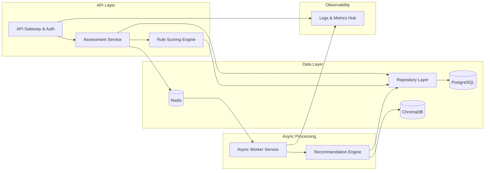

# Components

### API Gateway & Auth Layer
- **Responsibility:** HTTP routing, JWT auth, rate limiting, request validation.  
- **Key Interfaces:** `POST /api/v1/assessments/start`, `POST /api/v1/assessments/{id}/responses`.  
- **Dependencies:** Auth utilities, Assessment Service, Redis publisher, structlog.  
- **Tech:** FastAPI, Pydantic, slowapi, PyJWT.

### Assessment Service
- **Responsibility:** Manage assessment lifecycle, question snapshotting, rule scoring coordination.  
- **Key Interfaces:** `start_assessment`, `finalize_assessment`.  
- **Dependencies:** Repositories, Question catalog, Rule Scoring Engine, Async Job Producer.  
- **Tech:** SQLAlchemy repositories, domain models.

### Rule Scoring Engine
- **Responsibility:** Deterministic rule evaluation for non-essay questions.  
- **Key Interfaces:** `score_rules`, `get_rule_scores`.  
- **Dependencies:** Assessment Service, rule configuration, repositories.  
- **Tech:** Python modules with YAML/JSON rule definitions.

### Async Worker Service
- **Responsibility:** Process GPT essay scoring, RAG enrichment, recommendation assembly.  
- **Key Interfaces:** Redis job handlers (`essay_score`, `rag_enrich`).  
- **Dependencies:** Redis, OpenAI, Recommendation Engine, repositories.  
- **Tech:** RQ, rq-scheduler, structlog, OpenTelemetry.

### Recommendation Engine
- **Responsibility:** Fuse rule/GPT scores with vector retrieval and KNN blending.  
- **Key Interfaces:** `generate_recommendations`, `build_summary`.  
- **Dependencies:** ChromaDB, sentence-transformers, scikit-learn, Embedding registry.  
- **Tech:** LangChain, MiniLM embeddings, scikit-learn.

### Data & Repository Layer
- **Responsibility:** Centralized data access, transactions, audit logging.  
- **Key Interfaces:** Repository classes and unit-of-work context.  
- **Dependencies:** PostgreSQL, SQLAlchemy sessions.  
- **Tech:** SQLAlchemy async engine, Alembic migrations.

### Observability Hub
- **Responsibility:** Logs, traces, metrics export to platform monitoring.  
- **Key Interfaces:** OpenTelemetry exporters, Prometheus endpoints (optional).  
- **Dependencies:** API, workers, platform metrics.  
- **Tech:** structlog JSON logging, OpenTelemetry SDK.

## Component Diagram

