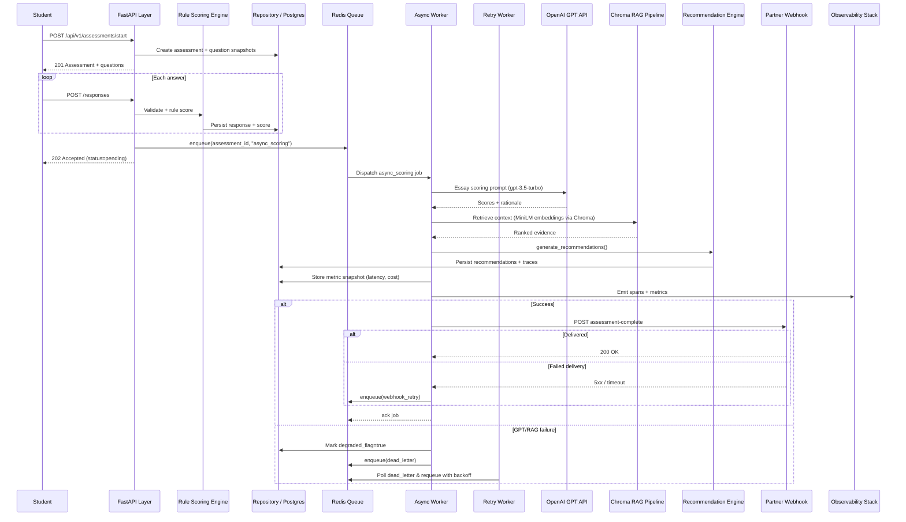
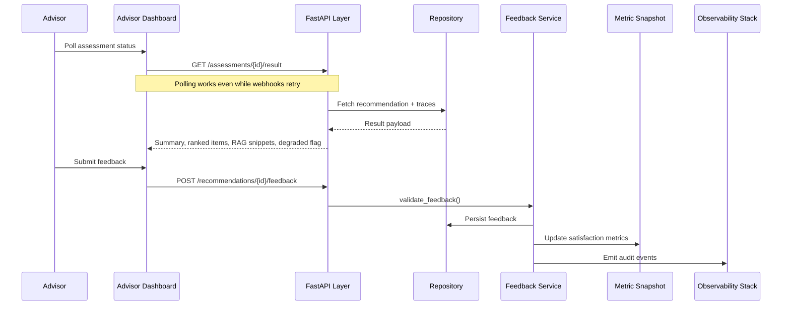

# Core Workflows

```mermaid
sequenceDiagram
  participant Student
  participant API as FastAPI Layer
  participant Rule as Rule Scoring Engine
  participant Repo as Repository / Postgres
  participant Queue as Redis Queue
  participant Worker as Async Worker
  participant RetryWorker as Retry Worker
  participant GPT as OpenAI GPT API
  participant RAG as Chroma RAG Pipeline
  participant Reco as Recommendation Engine
  participant Webhook as Partner Webhook
  participant Telemetry as Observability Stack

  Student->>API: POST /api/v1/assessments/start
  API->>Repo: Create assessment + question snapshots
  API-->>Student: 201 Assessment + questions
  loop Each answer
    Student->>API: POST /responses
    API->>Rule: Validate + rule score
    Rule->>Repo: Persist response + score
  end
  API->>Queue: enqueue(assessment_id, "async_scoring")
  API-->>Student: 202 Accepted (status=pending)

  Queue->>Worker: Dispatch async_scoring job
  Worker->>GPT: Essay scoring prompt (gpt-3.5-turbo)
  GPT-->>Worker: Scores + rationale
  Worker->>RAG: Retrieve context (MiniLM embeddings via Chroma)
  RAG-->>Worker: Ranked evidence
  Worker->>Reco: generate_recommendations()
  Reco->>Repo: Persist recommendations + traces
  Worker->>Repo: Store metric snapshot (latency, cost)
  Worker->>Telemetry: Emit spans + metrics
  alt Success
    Worker->>Webhook: POST assessment-complete
    alt Delivered
      Webhook-->>Worker: 200 OK
    else Failed delivery
      Webhook-->>Worker: 5xx / timeout
      Worker->>Queue: enqueue(webhook_retry)
    end
    Worker-->>Queue: ack job
  else GPT/RAG failure
    Worker->>Repo: Mark degraded_flag=true
    Worker->>Queue: enqueue(dead_letter)
    RetryWorker->>Queue: Poll dead_letter & requeue with backoff
  end
```

```mermaid
sequenceDiagram
  participant Advisor
  participant Dashboard as Advisor Dashboard
  participant API as FastAPI Layer
  participant Repo as Repository
  participant FeedbackSvc as Feedback Service
  participant Metrics as Metric Snapshot
  participant Telemetry as Observability Stack

  Advisor->>Dashboard: Poll assessment status
  Dashboard->>API: GET /assessments/{id}/result
  Note over Dashboard,API: Polling works even while webhooks retry
  API->>Repo: Fetch recommendation + traces
  Repo-->>API: Result payload
  API-->>Dashboard: Summary, ranked items, RAG snippets, degraded flag
  Advisor->>Dashboard: Submit feedback
  Dashboard->>API: POST /recommendations/{id}/feedback
  API->>FeedbackSvc: validate_feedback()
  FeedbackSvc->>Repo: Persist feedback
  FeedbackSvc->>Metrics: Update satisfaction metrics
  FeedbackSvc->>Telemetry: Emit audit events
```
