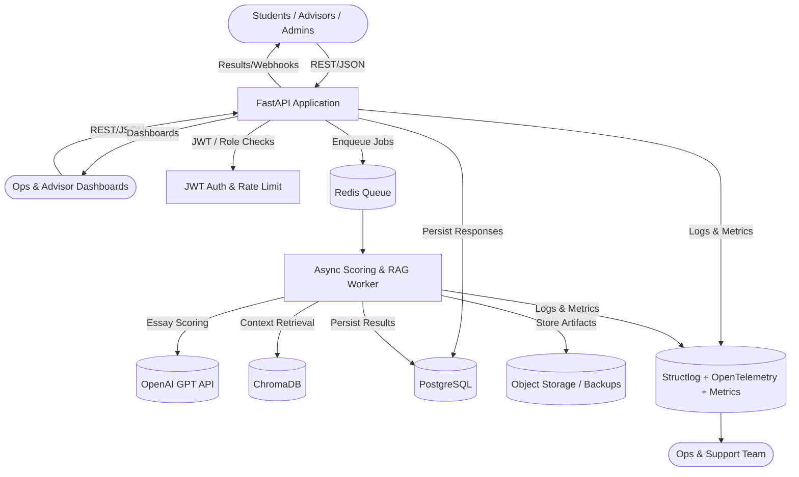

# High Level Architecture

## Technical Summary
The system is a domain-oriented modular monolith built on FastAPI with Redis-backed workers. Core components include the HTTP API, rule-based scoring engine, asynchronous GPT/RAG workers, PostgreSQL with ChromaDB for embeddings, and observability tooling. This structure satisfies the PRD’s async scoring, transparency, and cost goals while remaining simple to operate on low-cost platforms.

## High Level Overview
1. **Architectural Style:** Modular monolith with clearly separated domain modules (assessment intake, scoring, recommendations, observability).  
2. **Repository Structure:** Monorepo to share domain models, migrations, and infrastructure scripts.  
3. **Service Architecture:** FastAPI application for synchronous routes plus horizontally scaled RQ workers processing GPT/RAG tasks from Redis.  
4. **Primary Flow:** Students submit assessments → API validates and applies rule scoring → responses persisted → async jobs queued for GPT essay scoring and RAG enrichment → workers produce recommendations and traces → results exposed via polling/webhooks.  
5. **Key Decisions:** Retain monolith for MVP speed, isolate long-running work in Redis queues, leverage Postgres + Chroma for shared storage, and instrument everything with structured logs/metrics.

## High Level Project Diagram

## Architectural and Design Patterns
- **Domain-Oriented Modular Monolith:** Keeps implementation cohesive while preserving module boundaries for future extraction.
- **Queue-Based Work Dispatch:** Redis + RQ isolate GPT/RAG latency and provide retries/dead-letter handling.
- **Hexagonal Ports & Adapters:** External services (OpenAI, Chroma, webhooks) accessed through adapter modules to improve testability.
- **Repository + Unit of Work:** All persistence flows through repositories to enforce consistency between API and workers.
- **REST with Webhook Notifications:** REST APIs plus optional webhooks cover both polling and push-based advisor experiences.
